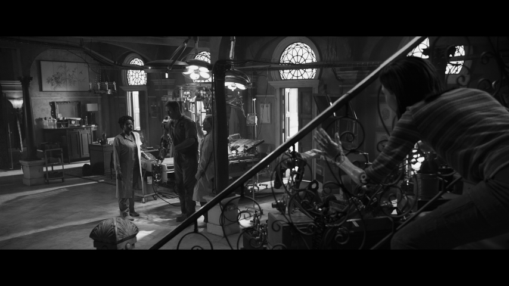
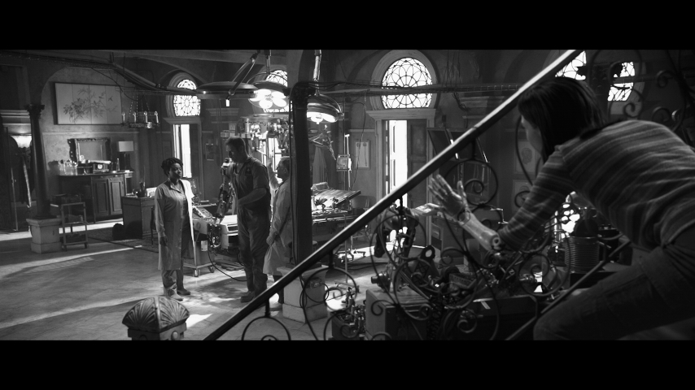
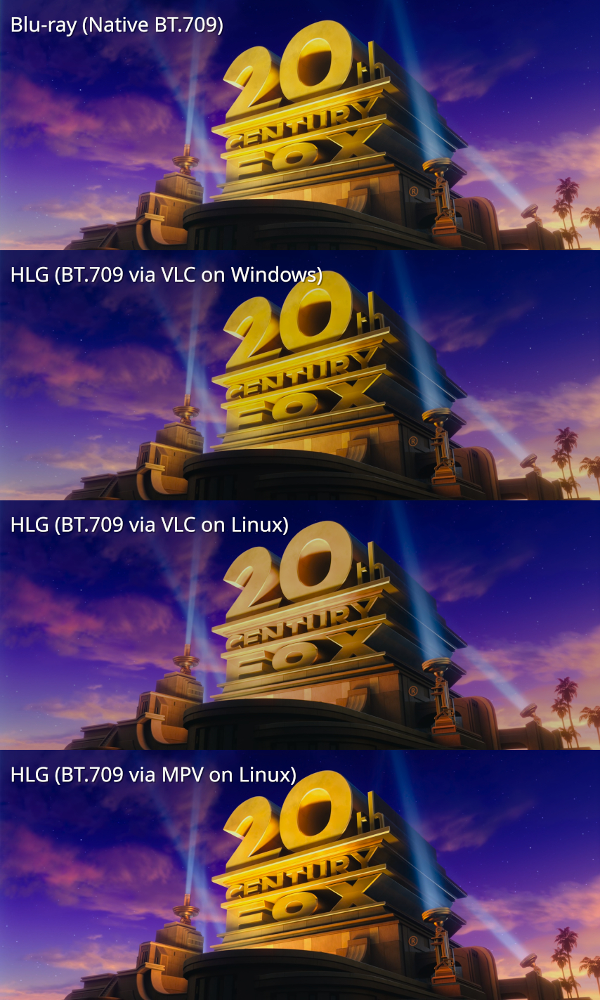
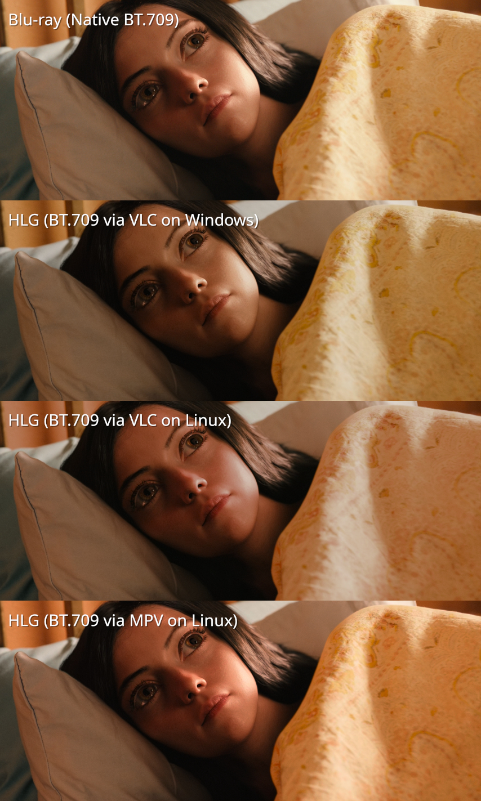
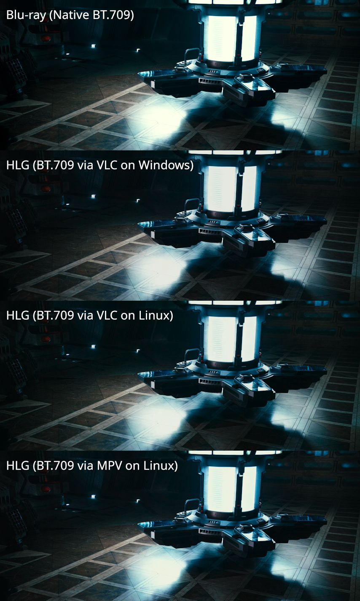
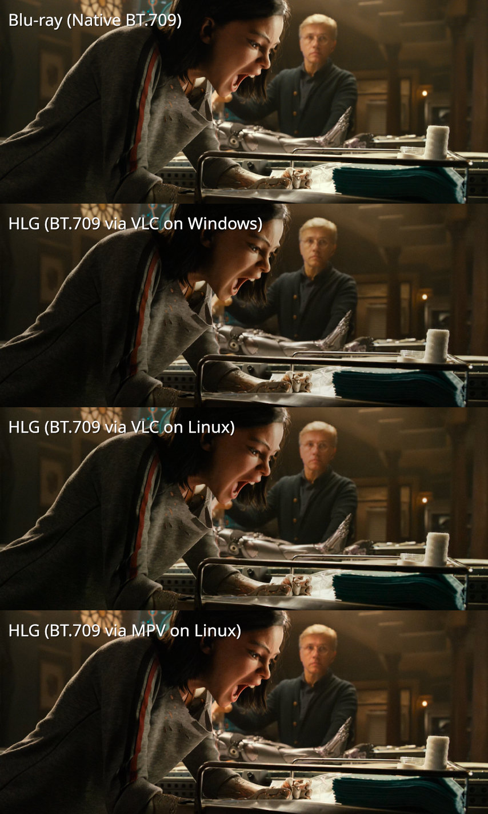
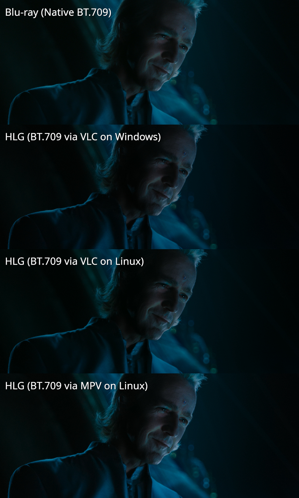

<!--
    This Source Code Form is subject to the terms of the Mozilla Public License, v. 2.0. If a
    copy of the MPL was not distributed with this file, You can obtain one at
    https://mozilla.org/MPL/2.0/.

    Copyright 2021 William Swartzendruber

    SPDX-License-Identifier: MPL-2.0
-->

# Introduction

This tool suite consists of the basics needed to generate 3D LUTs that will convert video
streams from Perceptual Quantizer (PQ) HDR into Hybrid-Log Gamma (HLG) HDR. This is intended
to facilitate individuals in converting their physical HDR10 video libraries into HLG, thereby
allowing more universal viewing on devices including SDR displays.

Most of the work here is based on ITU-R BT.2408.

Note that nothing here addresses the topic of decrypting physical media.

# Rationale

## PQ Weaknesses

While it is true that PQ offers a rather large amount of dynamic range, the format has two main
weaknesses:

- PQ video streams **are** mastered for a specific viewing environment.
- PQ video streams **cannot** be reliably rendered on SDR displays with good results.

Regarding the first point above, PQ video streams are typically mastered for a viewing
environment of just 5 nits. Any increase in ambient lighting causes the displayed image to
appear darker than originally intended. This inherently limits what environments a PQ video can
be viewed in. Another way to look at this is that the viewer is expected to accommodate the
presentation.

Regarding the second point above, PQ is inherently difficult here because nothing about the
signal data indicates how SDR downconversion should be handled. This is necessary because
applying the PQ gamma curve without processing will produce a picture that is simply too dim.
Static HDR10 metadata cannot help us here, either, because what we really need for SDR
downconversion is the reference white level, but that is not signaled.

## HLG Strengths

In light of these two issues, the United Kingdom's BBC and Japan's NHK cooperated to create an
entirely new HDR format. This resulted in HLG which has two main strengths:

- HLG video streams **are not** mastered for a specific viewing environment.
- HLG video streams **can** be reliably rendered on SDR displays with good results.

Regarding the first point above, HLG video streams are mastered in relative brightness. This
means that instead of mastering the signal for a fixed viewing environment, HLG streams contain
more generic signal data that the display then alters according to its settings. Ergo, if the
viewing environment changes, the display can simply be adjusted and the same video can then be
viewed again with these new settings.

Regarding the second point above, HLG is inherently easy here because its gamma curve was
designed for it. That is, a HLG video signal can be naively displayed on a SDR device with more
acceptable results. Additionally, since HLG *does* define a fixed reference white level,
HLG-aware players can modify the picture accordingly. The end result is that given the
combination of a correctly mastered (or converted) HLG stream and a HLG-aware player, it can be
extremely difficult to tell that a picture wasn't natively mastered for SDR. Some players are
also good at downconverting BT.2020 color to BT.709 color as a part of this process. MPV is one
such player.

# Procedure

## Prerequisites

Now let's walk through converting a 4K UltraHD Blu-ray to HLG. For this scenario, we'll be using
`pq2hlg` along with `ffmpeg`, VLC, and a concise script that's provided below. In particular,
we'll be assuming that the following binaries are in the `PATH`:

- `hlgprev.sh` (defined below)
- `pq2hlg` (part of the `hlg-tools` package)
- `ffmpeg` (provided by distribution or third party)

`hlgprev.sh` consists of:

```bash
#!/usr/bin/env bash

set -e

if [ "$#" -ne 5 ]; then
	echo "hlgprev.sh [pq-input] [max-cll] [lum-scale] [timestamp] [name]"
	exit
fi

LUT="$(mktemp --suffix=.cube)"

pq2hlg --preview --max-cll "$2" --lum-scale "$3" --size 64 "$LUT"

ffmpeg -ss "$4" -i "$1" -vf scale=1920:1080,format=rgb48le,lut3d="$LUT",format=yuv420p \
	-color_primaries bt709 -color_trc bt709 -colorspace bt709 \
	-vframes 1 "$5-$3-$(echo $4 | sed 's/:/_/g').png"

rm -f "$LUT"
```

We will also assume the presence of a disc dump in the form of a file called `source.mkv`. In
actuality, this is a MakeMKV dump of *Alita: Battle Angel*. We'll also be scaling down to
1920x800, which is this movie's native aspect ratio inside of a 1080p frame. This will allow
important detail to be preserved while also permitting playback on most current mobile devices.

## Determine MaxCLL

The first thing we're after is the movie's MaxCLL property. According to specification, each
HDR10 video stream is supposed to have a single, fixed value for this. However, I have found
that at least one movie has two different MaxCLL values, one for the 20th Century Fox intro and
another for the rest of the stream. I am, of course, referring to our example movie.

For this part, I recommend opening the HDR10 stream in a player like VLC and skipping around,
checking the MaxCLL value at different parts of the movie. Use the highest value you find.

With VLC 3, this information is available via the menu bar: `Tools` -> `Codec Information`.
In the dialog that appears, look for the item called `MaxCLL`.

In the case of *Alita: Battle Angel*, this value is 737 nits.

## Determine the Luminosity Scaling Factor

The second thing we're after is the movie's luminosity scaling factor. We need this because
while UHD discs follow no clear standard for brightness levels, HLG does. And so, the brightness
of the input video needs to be adjusted to match HLG's expectations. The unfortunate truth of
the matter is that this requires a brief bit of trial and error. If it's not correctly set, the
picture will appear either too bright or too dark when played back on SDR.

The purpose of the `hlgprev.sh` script is to output a single black and white frame of the video
being converted in order to preview its SDR appearance. The reason the preview output is
grayscale is to eliminate any issues with BT.2020 to BT.709 colorspace conversion.

`hlgprev.sh` has the following syntax:

`hlgprev.sh [pq-input] [max-cll] [lum-scale] [timestamp] [name]`

Begin by entering the following command:

`hlgprev.sh source.mkv 737 1.0 5:30 alita`

This will generate a single file named `alita-1.0-5_30.png`, representing a screenshot of the
movie at the `5:30` mark with a MaxCLL value of `737` and a luminosity scaling factor of `1.0`.

However, look at the image that's been generated and notice that it's obviously too dark:


Now try again, but with a luminosity scaling factor of `2.0`:

`hlgprev.sh source.mkv 737 2.0 5:30 alita`

This causes the following screenshot named `alita-2.0-5_30.png` to be produced:



Now this is much better, but the light coming in from the outside is still a bit on the dim
side. Let's take the luminosity scaling up to `4.0` and see what happens:

`hlgprev.sh source.mkv 737 4.0 5:30 alita`

This yields a file named `alita-4.0-5_30.png`:



The correct scaling value is ultimately determined by the user based on what looks right. Be
sure to take sample frames from multiple timestamps. What looks good in one shot may not look
good in another.

Those wishing to be extremely accurate at this stage may wish to take screenshots of the SDR
Blu-ray, convert them to grayscale, and then compare them to the output of `hlgprev.sh`. When
using this method, be sure to compare the brightness levels of the midtones and shadows rather
than the highlights. With this approach, the optimal luminance scaling factor for *Alita: Battle
Angel* happens to be very near `4.75`. For most movies, SDR screenshots can be sourced from
[Blu-ray.com](http://blu-ray.com).

Regardless, do not be overly concerned with preserving detail in the highlights. While the whole
point of HDR is to retain such detail, it can be lost during SDR preview while still being
correct.

## Generate the LUT

Now we're ready to generate the 3D LUT using the values we've determined in the previous steps:

```
pq2hlg -m 737 -l 4.75 -s 128 alita-battle-angel.cube
```

This will generate a 128x128x128 3D LUT that we can now pass into `ffmpeg` (or something else,
if we so desire).

## Perform the Conversion

Now let's invoke `ffmpeg` with our new LUT:

```
ffmpeg -i source.mkv \
    -vf crop=3840:1600,scale=1920:800,format=rgb48le,lut3d=alita-battle-angel.cube,format=yuv420p10le \
    -color_primaries bt2020 -color_trc bt2020-10 -colorspace bt2020nc \
    -c:v libx265 -crf 20 -preset slower -tune grain -x265-params atc-sei=18:pic_struct=0 \
    video.h265
```

Note that this example handles only the video and not any other assets such as audio or
subtitles.

# Resulting HLG

The outcome of this example can be seen in the multiple screenshot comparisons below. The top
frame in each one is the native SDR Blu-ray, followed by the HLG output under a few different
playback scenarios. Of course, the HDR nature of the output cannot be expressed in this way, but
must be seen on a true HDR display in order to be witnessed.













# Conclusion

It is feasible to convert HDR10 discs into HLG for compatible viewing with excellent results.
The weak point in this process is in correctly determining each disc's luminosity scaling
factor.

# Licensing

Different portions of this project are placed under different licenses:

| Component     | License                    | SPDX ID                           |
|---------------|----------------------------|-----------------------------------|
| Application   | Mozilla Public License 2.0 | [`MPL-2.0`](LICENSES/MPL-2.0.txt) |
| Documentation | Mozilla Public License 2.0 | [`MPL-2.0`](LICENSES/MPL-2.0.txt) |
| Build scripts | Public Domain              | [`CC0-1.0`](LICENSES/CC0-1.0.txt) |
| Unit tests    | Public Domain              | [`CC0-1.0`](LICENSES/CC0-1.0.txt) |

All screenshots of *Alita: Battle Angel* are copyrighted by 20th Century Fox with all rights
reserved. They are included here under fair use guidelines.
